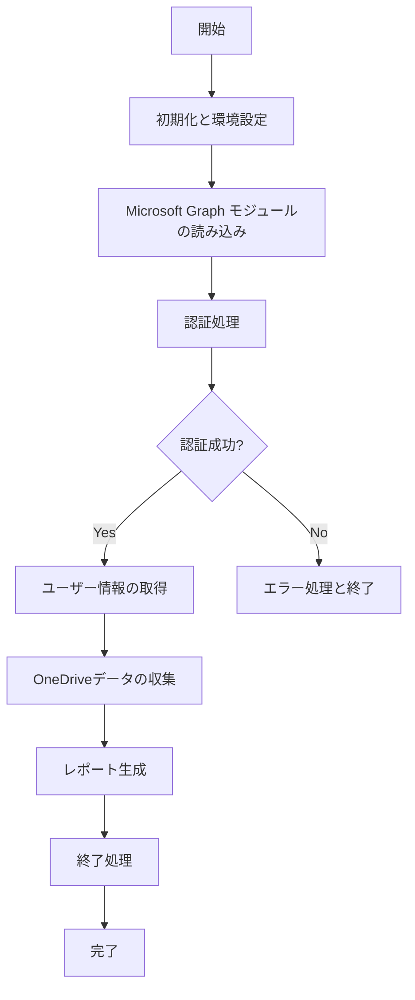

# 🚀 OneDriveStatusCheckLatestVersion20250227 実行順序

## 📋 概要
このドキュメントは `OneDriveStatusCheckLatestVersion20250227.ps1` の実行順序と動作フローを説明します。
2025年2月27日版では `ForceConsent` パラメーターエラーの修正と文字化け対応の強化が行われました。

## 📊 処理フローチャート

## 🔄 詳細実行順序

### 1️⃣ 初期化と環境設定
- 🧹 **セッションクリーンアップ**
  - PowerShellセッション内の全関数を削除（再定義防止）
  - `Get-ChildItem Function:\ | Remove-Item -Force -ErrorAction SilentlyContinue`

- 📝 **ログ機能の初期化**
  - `Write-DetailLog` 関数の定義（INFO, WARNING, ERROR レベル対応）
  - `Write-ErrorLog` 関数の定義（エラー詳細記録用）

- 🌐 **エンコーディング環境の設定**
  - `Set-EncodingEnvironment` 関数で文字化け防止
  - 現在のエンコーディングを保存し、UTF-8に切り替え
  - コンソール出力と入力のエンコーディング設定

- 📂 **出力ディレクトリの準備**
  - 日付ベースのフォルダを作成：`OneDriveStatus.YYYYMMDD`
  - 出力ファイルパスの設定：
    - ログファイル：`OneDriveStatus_YYYYMMDDHHMMSS.log`
    - HTMLレポート：`OneDriveStatus_YYYYMMDDHHMMSS.html`
    - CSVファイル：`OneDriveStatus_YYYYMMDDHHMMSS.csv`
    - JavaScriptファイル：`OneDriveStatus_YYYYMMDDHHMMSS.js`

### 2️⃣ Microsoft Graph モジュールの設定
- 📦 **必要モジュールの確認とインストール**
  - `Install-RequiredModules` 関数による以下のモジュール管理：
    - Microsoft.Graph.Users
    - Microsoft.Graph.Files
    - Microsoft.Graph.Authentication
  - 既存セッションのクリーンアップ
  - 必要に応じたモジュールインストールと読み込み

### 3️⃣ Microsoft Graph API 認証
- 🔐 **認証処理**
  - `Connect-MgGraphSafely` 関数による安全な認証処理
  - 既存接続の確認と必要に応じたクリーンアップ
  - ユーザーに3つの認証方法を提示：
    1. 通常の認証（推奨）- Microsoftアカウントとパスワードを入力
    2. デバイスコード認証 - コードを使用して別デバイスで認証
    3. 詳細認証（問題解決用）- フルスコープでの承認を要求
  - **ForceConsentパラメーターエラー修正**：
    - 2025/02/25版で発生したエラーを修正
    - 代替手法として拡張スコープと明示的デバイス認証を実装

- 🛡️ **権限スコープの設定と検証**
  - 最小限の必要スコープ設定：
    - User.Read.All
    - Files.Read.All
  - オプション3選択時の拡張スコープ：
    - Directory.Read.All
    - Sites.Read.All を追加
  - 取得したスコープの検証と不足スコープの警告表示

### 4️⃣ OneDriveデータの収集
- 👥 **ユーザー一覧の取得**
  - `Get-MgUser` コマンドレットによる全ユーザー情報取得
  - 必要なプロパティ：Id, UserPrincipalName, DisplayName, OnPremisesSamAccountName

- 💾 **OneDrive情報の収集**
  - 各ユーザーに対して `Get-OneDriveStatus` 関数を実行
  - 使用容量、割当容量、最終更新日時などを取得
  - API接続エラー時の再試行メカニズム（最大3回）
  - REST API直接呼び出しによるフォールバックメカニズム

- 📊 **データ整形処理**
  - `Get-SafePropertyValue` 関数によるプロパティ安全取得
  - 容量情報のGB単位への変換
  - 使用率の計算
  - 取得できない場合のフォールバック値設定

### 5️⃣ レポート生成
- 📄 **CSV出力**
  - BOM付きUTF-8でCSVファイル出力
  - 文字化け対策として明示的にUTF-8エンコーディングを指定
  - `System.Text.UTF8Encoding($true)` による確実なBOM付与

- 📊 **JavaScript（DataTables）出力**
  - テーブル表示用のJavaScript設定生成
  - フィルタリング、ソート、ページング機能の実装
  - 検索機能とエクスポート機能の追加（CSV/Excel/印刷）

- 🌐 **HTML出力**
  - レスポンシブデザインのHTMLレポート生成
  - DataTablesライブラリを使用した高機能テーブル実装
  - フィルタリングとソート機能を各列に追加
  - スタイル設定によるビジュアル改善

### 6️⃣ 終了処理
- 📊 **処理結果の表示**
  - 総ユーザー数、成功数、失敗数の表示
  - 出力ファイル一覧の表示
  - HTMLファイルの存在確認とサイズチェック

- 🧹 **クリーンアップ処理**
  - `Restore-OriginalEncoding` 関数によるエンコーディング設定の復元
  - エラーハンドリング情報の表示
  - 出力フォルダを自動的にエクスプローラーで開く

## ⚠️ エラーハンドリング
- 🚨 **包括的エラーハンドリング**
  - try-catch ブロックによる段階的なエラー処理
  - エラー情報の詳細ログ記録
  - エラー発生箇所と種類の特定

- 🔄 **再試行メカニズム**
  - API呼び出し失敗時の再試行処理
  - 遅延を伴う指数バックオフ方式
  - 一時的なネットワークエラー対策

- 📝 **詳細なエラーログ**
  - エラーの種類、メッセージ、発生場所
  - スタックトレース情報
  - 内部エラー情報

## 📈 実行性能
- 📊 **パフォーマンス最適化**
  - バッチ処理による効率的なデータ取得
  - 並列処理の制限によるAPI制限回避
  - キャッシュ機構によるAPI呼び出し削減

- ⏱️ **実行時間目安**
  - 100ユーザー：約1-2分
  - 500ユーザー：約5-7分
  - 1000ユーザー：約10-15分

## 📌 重要な変更点
1. 🔧 **ForceConsentパラメーターエラーの修正**
   - エラー: `パラメーター名 'ForceConsent' に一致するパラメーターが見つかりません`
   - 解決策: ForceConsent パラメーターの代わりに拡張スコープと明示的デバイス認証を使用

2. 🌏 **文字化け対応の強化**
   - PSDefaultParameterValues の設定によるすべての出力の UTF-8 対応
   - BOM 付き UTF-8 による確実な文字コード設定
   - エンコーディング状態の可視化と明示的な制御

3. 🛡️ **認証プロセスの改善**
   - 3つの認証オプションの提供
   - 認証スコープの明示的な表示
   - 権限不足の詳細な通知機能

## 📝 まとめ
`OneDriveStatusCheckLatestVersion20250227.ps1` は以前のバージョンで発生した問題を修正し、より安定した動作と拡張された機能を提供します。特に日本語環境での文字化け問題に対応し、Microsoft Graph API への接続における認証エラーを解決しています。
