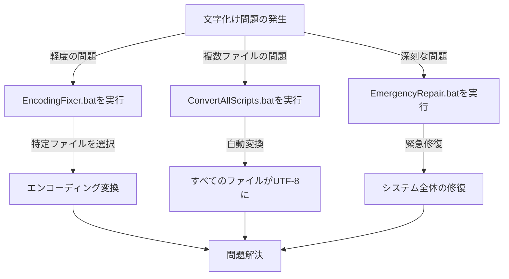

# 🛠️ OneDrive運用ツール 修正ツール集

このフォルダには、OneDrive運用ツールの動作を改善・修正するためのユーティリティが含まれています。

## 📦 含まれるツール

### 🔤 エンコーディング修正関連

| 🔧 ファイル名 | 📝 説明 |
|------------|------|
| `EncodingFixer.ps1` | 🖥️ PowerShellスクリプトの文字化けを修正するツール（GUI） |
| `EncodingFixer.bat` | 🚀 EncodingFixerを起動するバッチファイル |
| `CreateFixerScript.ps1` | 🔄 UTF-8でEncodingFixer.ps1を再生成するスクリプト |
| `EncodingCheck.ps1` | 🔍 ファイルのエンコーディングを検出・表示するスクリプト |
| `ConvertAllScripts.bat` | 📦 すべてのスクリプトをUTF-8に一括変換 |
| `EmergencyRepair.bat` | 🚑 エンコーディングエラー緊急修復バッチ |

## 📝 使用方法

### 🔤 エンコーディング修正ツール

1. 🖱️ `EncodingFixer.bat` をダブルクリックでGUIツールを起動
2. 📂 対象フォルダを選択（デフォルトは `C:\kitting\OneDrive運用ツール`）
3. 🔍 「ファイルをスキャン」をクリックして文字化けしている可能性のあるファイルを検出
4. 🔄 エンコーディングオプションを選択（PowerShellスクリプトにはUTF-8 BOM付き、バッチファイルにはUTF-8 BOMなし推奨）
5. 🔄 変換したいファイルを選択して「エンコーディング変換」をクリック

### 📦 一括変換

* 🚀 `ConvertAllScripts.bat` を実行すると、すべてのPS1/BAT/MDファイルをUTF-8に一括変換します。

### 🔍 エンコーディング確認

* 🔎 `EncodingCheck.ps1` を実行すると、指定されたファイルやフォルダ内のファイルのエンコーディングを確認できます。

## ⚠️ トラブルシューティング

エンコーディングの問題が解決しない場合は、次の手順をお試しください：

1. 🚑 `EmergencyRepair.bat` を管理者として実行
2. 💻 PowerShellコンソールで実行する際に以下のコードを先頭に追加：
   ```powershell
   [Console]::OutputEncoding = [System.Text.Encoding]::UTF8
   $OutputEncoding = [System.Text.Encoding]::UTF8
   ```

## ℹ️ 技術情報

* 📄 PowerShellスクリプト（.ps1）はUTF-8 (BOM付き) で保存することが推奨されます
* 📄 バッチファイル（.bat, .cmd）はUTF-8 (BOMなし) で保存することが推奨されます
* 🔤 バッチファイルでは `chcp 65001 > nul` を使ってUTF-8モードに切り替えています
* 🖥️ PowerShellスクリプトでは `[Console]::OutputEncoding` を設定しています

## 🔄 修正ツールの使用フロー



## 📋 チェックリスト

- [ ] 文字化けが発生しているファイルを特定
- [ ] 適切な修正ツールを選択
- [ ] バックアップの作成（重要なファイルの場合）
- [ ] 修正ツールの実行
- [ ] 修正後の動作確認
