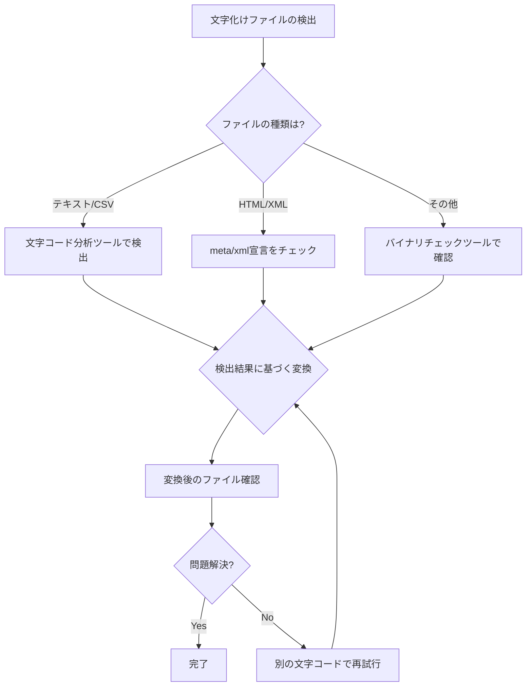

# 🔤 文字化け対応マニュアル

## 📋 目次
1. [📚 文字化けについて](#文字化けについて)
2. [🔧 文字化け診断・修正ツールの使い方](#文字化け診断修正ツールの使い方)
3. [💻 コマンドラインでの文字コード変換](#コマンドラインでの文字コード変換)
4. [❓ よくある文字化けの問題と対処法](#よくある文字化けの問題と対処法)

## 📚 文字化けについて

### 🔍 文字化けの原因

文字化けは主に以下の原因で発生します：

1. **🔄 異なる文字コード間の変換ミス**：
   - UTF-8で作成されたファイルをShift-JISとして開く
   - Shift-JISで作成されたファイルをUTF-8として開く

2. **⚠️ 対応していない文字の使用**：
   - 環境依存文字（①②③、Ⅰ・Ⅱ・Ⅲなど）
   - 異体字、特殊記号

3. **🔣 BOM（Byte Order Mark）の有無**：
   - UTF-8のBOMあり/なしの違いによる問題

### 📊 主な日本語文字コード

| 文字コード | 特徴 |
|------------|------|
| 🌐 **UTF-8** | 国際標準、多言語対応、Webで一般的 |
| 🇯🇵 **Shift-JIS** | 日本で広く使われてきた、Windows標準（レガシー） |
| 🖥️ **EUC-JP** | UNIXシステムで使われてきた日本語エンコーディング |
| 📧 **ISO-2022-JP** | 電子メールで使われることが多い |

## 🔧 文字化け診断・修正ツールの使い方

### 🚀 ツールの起動方法

1. `文字化け修正.bat` をダブルクリックして起動します。
2. または、PowerShellから直接 `CharacterEncodingFixer.ps1` を実行します。

### 📋 基本的な使用手順

1. **📂 ファイルの選択**：
   - 「参照...」ボタンをクリックし、文字化けしているファイルを選択します。
   - ファイルを選択すると自動的に文字コード分析が行われます。

2. **🔍 文字コード分析**：
   - 「文字コードを分析」ボタンをクリックすると、選択したファイルの文字コードを自動検出します。
   - 検出結果と信頼度（%）がプレビュー画面に表示されます。

3. **🔄 文字コード変換**：
   - 「元の文字コード」で自動検出されたエンコーディングを使用するか、手動で選択します。
   - 「変換後の文字コード」で目的の文字コードを選択します。
   - 「文字コードを変換」ボタンをクリックして変換を実行します。

4. **👁️ 変換結果の確認**：
   - 変換されたファイルの内容がプレビュー画面に表示されます。
   - 元のファイルは `.backup` の拡張子で自動的にバックアップされます。

## 💻 コマンドラインでの文字コード変換

高度な操作や自動化が必要な場合は、PowerShellスクリプト `CharacterEncodingTool.ps1` を直接使用することができます。

### 🔰 基本的な使い方

```powershell
.\CharacterEncodingTool.ps1 -InputFile "変換するファイルパス" -SourceEncoding "元の文字コード" -TargetEncoding "変換後の文字コード"
```

### 🔍 文字コードの自動検出

```powershell
.\CharacterEncodingTool.ps1 -InputFile "確認するファイルパス" -Detect
```

### 📝 例: Shift-JISからUTF-8への変換

```powershell
.\CharacterEncodingTool.ps1 -InputFile "C:\example\data.txt" -SourceEncoding "shift-jis" -TargetEncoding "utf-8"
```

## ❓ よくある文字化けの問題と対処法

### 📊 CSVファイルの文字化け

**🔴 症状**: Excelで開くと日本語が文字化けする

**✅ 対処法**:
1. ファイルの文字コードを「Shift-JIS」に変換する
2. ExcelでCSVを開く際に、「データ」タブから「外部データの取り込み」→「テキストファイル」を選択し、文字コードを指定する

### 📝 テキストエディタでの文字化け

**🔴 症状**: テキストエディタで開くと文字化けして表示される

**✅ 対処法**:
1. エディタの「開く」ダイアログで正しい文字コードを指定する
2. または文字コード変換ツールで適切な文字コードに変換する

### 🌐 Webページでの文字化け

**🔴 症状**: ブラウザで表示すると文字化けする

**✅ 対処法**:
1. HTMLファイルの先頭に適切な文字コード指定の`meta`タグが含まれているか確認
   ```html
   <meta charset="UTF-8">
   ```
2. Webサーバーの設定でContent-Type headerが正しく設定されているか確認

### 🈁 異体字や環境依存文字による問題

**🔴 症状**: 特定の漢字や記号だけが文字化けする

**✅ 対処法**:
1. JIS第1・第2水準の範囲内の文字を使用する
2. 機種依存文字を一般的な文字に置き換える（例: ① → (1)）

## 📈 文字コード変換の流れ



---

🔔 このマニュアルや文字化け対応ツールに関するお問い合わせは管理者までお寄せください。
